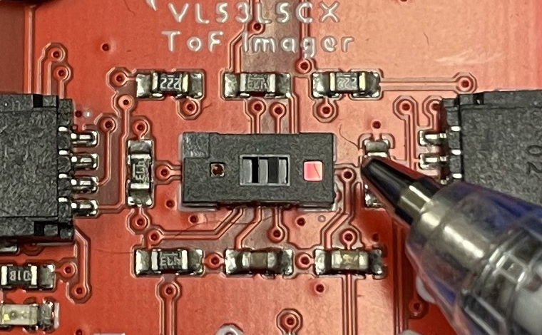
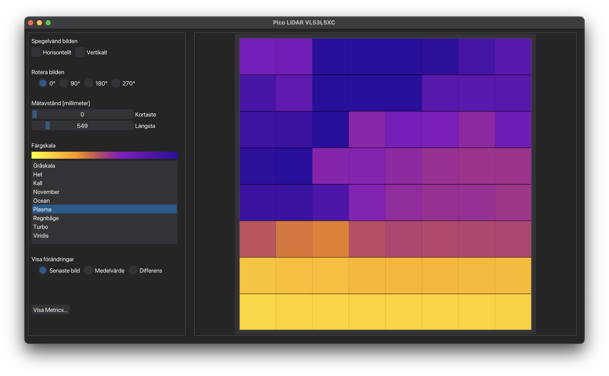

VL53 är en serie med små LiDAR-sensorer som kan ytmonteras på kretskort. De utvecklas av ST Microelectronics. Denna typ av sensor kan mäta avstånd till objekt med hög noggrannhet. Den mäter avstånd genom att sända ut pulser med osynligt laserljus och räknar tiden tills ljuset reflekteras tillbaka. Denna teknik kallas för (direkt) Time-of-Flight (ToF).

Det finns flera sensorer i VL53-serien med olika egenskaper t.ex. räckvidd, som kan vara från 1 meter till 10 meter. De flesta mäter avståndet till en punkt. Sensorn i vår demonstrator är en VL53L5CX som mäter avståndet till 8x8 punkter samtidigt i ett synfält som är 65°, avstånd upp till 4 meter och 15 mätningar per sekund. 

*Figur 1 - VL53L5CX monterad på ett kretskort. Denna LiDAR är endast ca 7 x 4 mm stor.*

I vår demonstrator styrs LiDAR-sensorn av en mikrokontroller (RP2040) som sedan skickar mätdata vidare över WiFi så att man kan ta emot den på en dator och visualisera den. Programmet på mikrokontrollern är skrivet i C++ och programmet på PC eller Mac för visualisering är skrivet i Python.

*Figur 2 - Avståndsdata från LiDAR-sensor som visualiseras med falsk färg. Gult är nära, blått är längre bort.*

Avståndsmätande sensorer som denna används i ett brett spann av tillämpningar som inkluderar robotar, industriell automation, drönare, hemautomation. De kan användas för att detektera närvaro, gester, objekt, flöden, undvika kollision, etc. 

- Vilka ideer får du när du ser datan från denna sensor?
- Hur skulle man kunna använda denna data?
- Kan man kombinera denna information med någon annan information?
